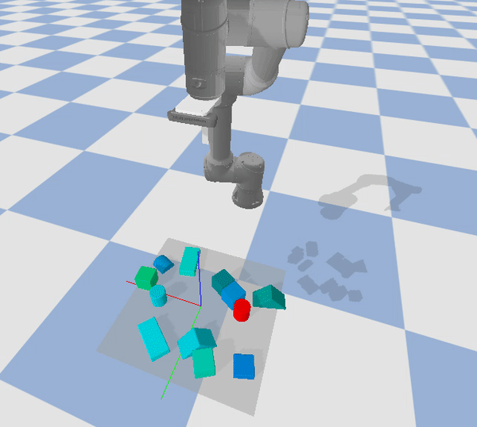
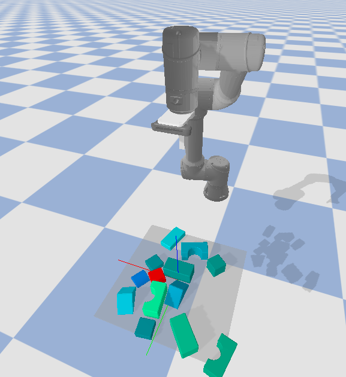

# Hybrid Pushing Policy
This repository provides the code for the paper entitled 'A Hybrid Pushing Policy for Total Singulation in Dense Clutter'.

## Installation
Create a virtual environment and install the package.
```shell
virtualenv ./venv --python=python3
source ./venv/bin/activate
pip install -e .
```

Install PytTorch 1.9.0
```shell
pip install torch==1.9.0+cu111 torchvision==0.10.0+cu111 torchaudio==0.9.0 -f https://download.pytorch.org/whl/cu111/torch_stable.html
```

## A Quick-Start: Demo in Simulation




This demo runs our pre-trained model with a UR5 robot arm in simulation on challenging picking scenarios with adversarial clutter. The goal is to singulate the target object (red one) from its surrounding clutter.

### Instructions 
```commandline

```


## Training
To train the hybrid pushing policy from scratch with random goals in simulation run the following command:
```commandline

```

## Evaluation
```commandline

```
